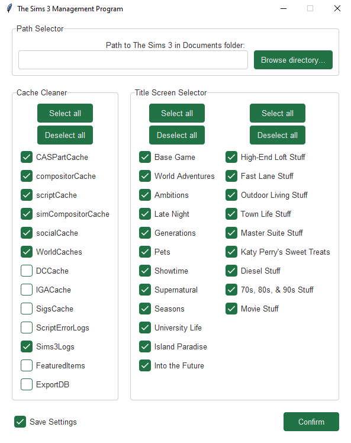
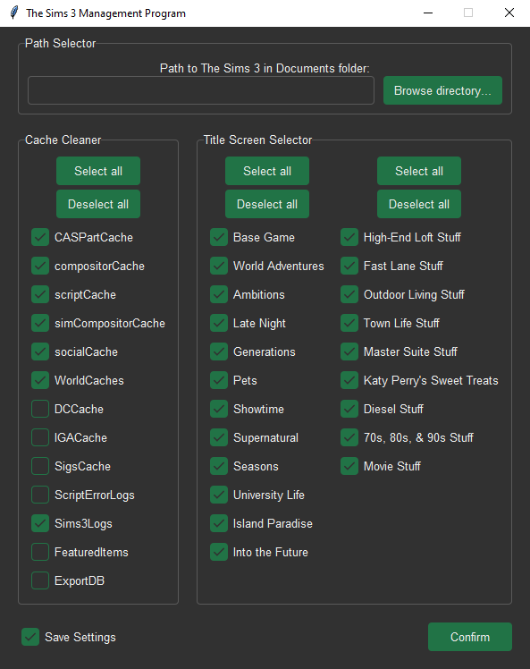

# The Sims 3 Management Program

[](LICENSE)
[](#)

This is a simple python script to clear all the caches of The Sims 3. It is written in python 3.10 and uses tkinter for the GUI.

It is intended to launch before every gameplay. You have to take care of that yourself. Instructions on how to do that are listed at Create a desktop shortcut.

## Screenshots

Light Mode                | Dark Mode
:------------------------:|:-----------------------:
 | 

## Usage

### Run script

Make sure Python 3.10 or higher is installed. Only tkinter is required as an external dependency.

```bash
pip install tk -U
git clone --recurse-submodules https://github.com/jonaheinke/the-sims-3-management-program.git
python the-sims-3-management-program/main.py
```

### Alternative: Create a desktop shortcut

Add a `The Sims 3.cmd` file to your desktop and put the following lines in it:

```bash
python ABSOLUTE_PATH_TO_MAIN_PY
ABSOLUTE_PATH_TO_Sims3LauncherW.exe_IN_QUOTATION_MARKS
```

### All Command line arguments

| Name      | Option       | Description                         |
|-----------|--------------|-------------------------------------|
| Help      | `-h, --help` | show help message                   |
| Lightmode | `--light`    | enable light mode                   |
| Debug     | `--debug`    | enable debug mode (not recommended) |

## Known Issues

Planned:
- None

Waiting list:
- The main menu logo is still the latest installed expansion or stuff pack logo.

Won't be fixed:
- None

## Credits

used tkinter theme: [Forest theme by rdbende](https://github.com/rdbende/Forest-ttk-theme)